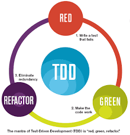
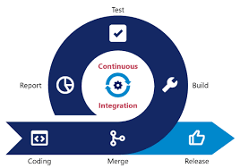

# Blocco Appunti....

Piccolo e-Book con una lista di argomenti da studiare per la mia posizione da Back-end developer.

Nel book sono inoltre presenti vari progetti esempio per il test degli argomenti.

[Dai un'occhiata ora](https://elpiu.github.io/cose-da-studiare/)

# Progetti svolti
Main folder [Qui](esercitazioni/)

#### Maven
* [1](esercitazioni/maven/Generate%20multi%20module%20Project%20Maven/)
* [2](esercitazioni/maven/Generate%20simple%20Project%20Maven/)
* [3](esercitazioni/maven/OtherMultiModuleProject/)
* [4](esercitazioni/maven/Spring%20MultiModule/)

#### Full Application
  * [1](esercitazioni/spring/Testing-Rest-Swagger-Bean/)
  * [2](esercitazioni/spring/Spring-Postgre-app/)

### Hosted by GitHub Pages
https://elpiu.github.io/cose-da-studiare/

# Contenuti

   
  
  
  
  
  
  
  
  

