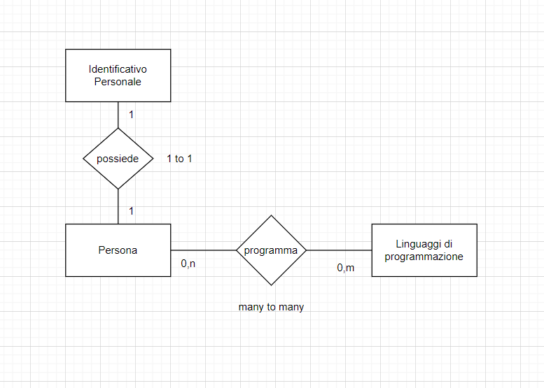
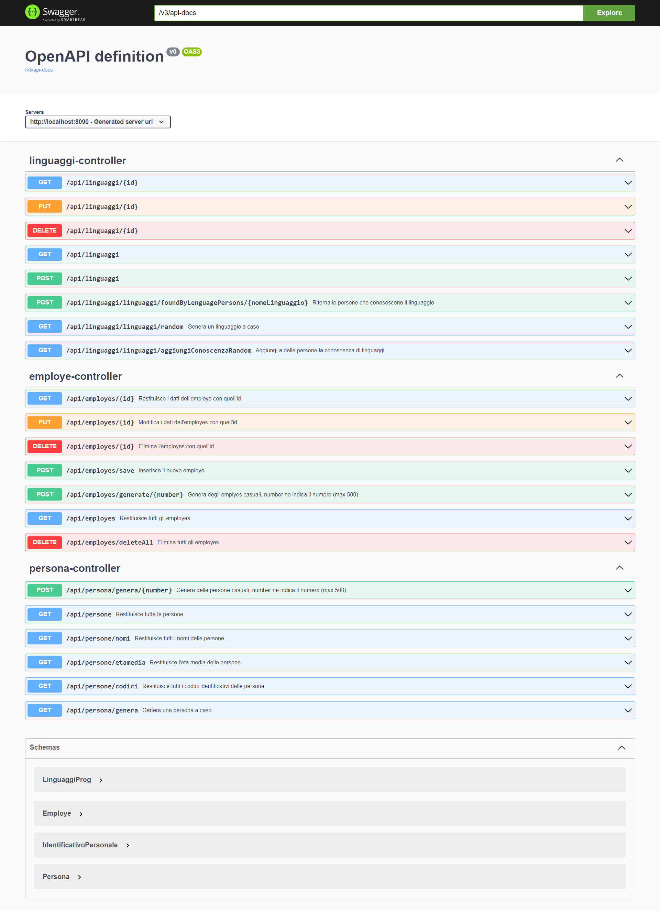

### Progetto inizializzato con [spring initializr](https://start.spring.io/)

#### Database PostgreSQL

# Dettagli
* Spring boot
* JDK 1.8
* Spring Framework
* Hibernate
* JPA
* Maven
* IntelliJ
* PostgreSQL
* Swagger

Faker dependency per la creazione di Entity con dati casuali.

Non sono stati implementati i Service, i controller utilizzano direttamente le Repository.

Si è utilizzato anche spring validation per impostare alcune regex sulle entity.

Utilizzato anche global exception handler per la gestione delle eccezioni.

Sono stati eseguiti solo alcuni test.

